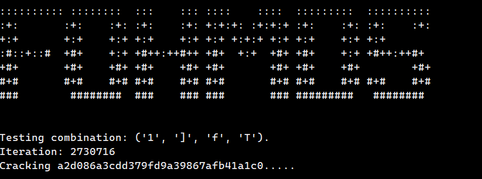

# fohmd5

Light weight MD5 hash cracker

## Getting Started

### Git
    1. Clone the repository: `git clone https://github.com/ttumeh/fohmd5.git`

## Running The Cracker

### Syntax

`fohmd5.py path/to/hash.txt -a dict -d path/to/dictionary.txt`

`fohmd5.py path/to/hash.txt -a brute -l start_length -ml max_length`

## Options
### Attack types

- dict (Dictionary Attack)
- brute (Standard Brute-Force Attack)

