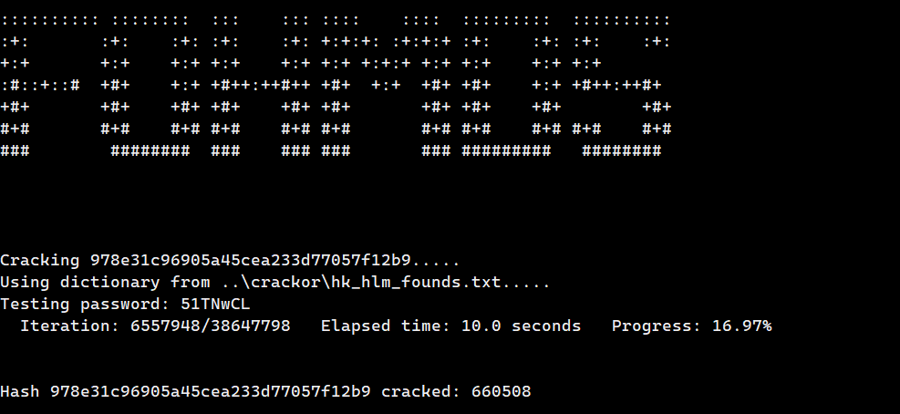

# fohmd5

MD5 hash cracker

## Getting Started

### Git
    1. Clone the repository: `git clone https://github.com/ttumeh/fohmd5.git`

### Docker

## Running The Cracker

### Syntax

`fohmd5.py path/to/hash.txt -a dict -d path/to/dictionary.txt`

`fohmd5.py path/to/hash.txt -a brute`

## Options
### Attack types

- dict (Dictionary)
- brute (Brute-Force)
